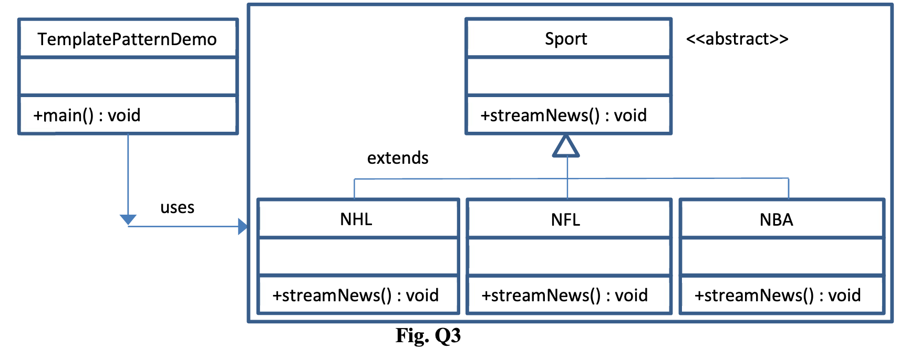

# ENSE 370 Winter 2020 Midterm Exam - Question 3

**PROMPT:** Consider a Sports News application where a user wants to receive news of various sports such as the NHL, NFL, NBA, etc. This is best achieved using the Template Pattern which allows the typw of sports news that is streamed to the user to be changed at run time. The class Diagram is shown in the figure below:

Write the Java code for the three classes Sport, NHL, and TemplatePatternDemo. You may assume that all the other classes are fully implemented. In the `main()` method, create an object instance `sport`, make it stream NHL news, and immediately after that make it stream NBA news.

**Instructions for Compilation**

`javac NBA.java NFL.java NHL.java Sport.java TemplatePatternDemo.java`

`java TemplatePatternDemo`
